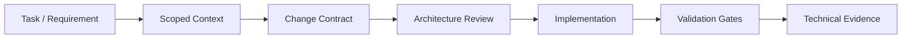

# CodeLife Modernization

> Legacy-system modernization and controlled AI-assisted software engineering
> developed as part of my Computer Engineering undergraduate thesis at CEFET-MG.

## Overview

This repository contains an experimental modernization of a scoped portion of
the legacy **CodeLife** educational platform.

The project has two complementary goals:

1. modernize a representative slice of a legacy web application using a
   contemporary full-stack architecture;
2. investigate how coding agents can participate in software engineering
   workflows while preserving explicit context, architectural decisions,
   validation and traceable evidence.

The goal is **not** to use AI only as a code-generation tool.

Instead, the repository defines constraints around how agents receive context,
plan changes, make architectural decisions, implement code and validate their
work.

The current implementation uses **NestJS, React and PostgreSQL**.

---

## AI-assisted engineering workflow

The repository organizes agent-assisted development around an explicit
engineering workflow:



The workflow is designed to reduce common risks of agent-assisted development,
such as:

- inventing requirements that are not present in the source material;
- loading excessive or unrelated context;
- silently overriding architectural decisions;
- mixing refactoring with behavioral changes;
- reporting validation that was never executed;
- losing traceability between decisions, implementation and evidence.

---

## Repository-level agent controls

### `AGENTS.md`

[`AGENTS.md`](./AGENTS.md) defines repository-wide instructions for coding
agents, including:

- source and instruction precedence;
- handling of uncertainty;
- scoped context loading;
- repository boundaries;
- rules for external Git actions;
- proportional validation requirements;
- restrictions against inventing requirements or evidence.

### Specialized skills

The repository contains specialized workflows under
[`.agents/skills`](./.agents/skills).

These skills provide task-specific instructions for activities such as:

- change contracts;
- architecture review;
- backend endpoint work;
- frontend validation;
- migration and modernization activities.

The intention is to avoid using one generic prompt for every engineering task.

### Scoped context

The [`.codex`](./.codex) directory contains context used to guide agents toward
the current implementation state and relevant architectural decisions.

Agents are expected to load only the context required for the task instead of
re-reading the entire project history for every change.

---

## Architecture Decision Records

Durable technical decisions are recorded as
[ADRs](./docs/adr).

Examples include decisions related to:

- monorepo organization;
- experimental identity and authentication;
- data modeling;
- API contracts and error handling;
- isolated database validation;
- validation gates and technical evidence;
- observability and health checks;
- feature-oriented backend organization;
- persistence ports;
- progress and domain modeling.

This allows implementation decisions to remain explicit and recoverable by
both humans and coding agents.

---

## Technical evidence

Validation results are kept separate from plans and assumptions.

The [`docs/evidence`](./docs/evidence) directory contains technical evidence
for behavior that has actually been validated.

The repository follows a simple rule:

> A validation must not be reported as successful if it was not executed,
> failed, or still depends on human inspection.

This distinction is particularly important when working with coding agents,
because generated explanations must not be treated as proof that a system
works.

---

## Application architecture

The modernized slice is organized as a TypeScript monorepo.

```text
.
├── apps/
│   ├── api/          NestJS backend
│   └── web/          React frontend
│
├── packages/
│   └── contracts/    Shared API-facing contracts
│
├── docs/
│   ├── adr/          Architecture Decision Records
│   └── evidence/     Validated technical evidence
│
├── .agents/
│   └── skills/       Specialized agent workflows
│
└── .codex/           Scoped engineering context
```

The backend uses PostgreSQL for persistence.

Shared contracts define the public boundary between the API and frontend.

---

## Current experimental slice

The implementation currently covers a controlled learning journey from the
legacy CodeLife platform.

The experimental slice includes:

- an authenticated journey;
- three levels;
- nine slides;
- progress persisted by level;
- sequential progression rules;
- progress resumption;
- explicit completion behavior.

The scope is intentionally limited so that modernization decisions can be
studied and validated without claiming a full rewrite of the original system.

---

## Backend diagnostics

The API exposes operational endpoints for basic runtime diagnostics.

### Liveness

```text
GET /health/live
```

Indicates whether the application process is running.

### Readiness

```text
GET /health/ready
```

Checks whether the application can reach PostgreSQL.

### API documentation

Swagger can be enabled through:

```text
SWAGGER_ENABLED=true
```

When enabled, the documentation is available at:

```text
/docs
```

Requests and logs are correlated using `x-request-id`.

Internal implementation details should not be exposed through API errors.

---

## Validation

The repository provides two primary validation gates.

### Fast validation

```bash
pnpm check
```

Used as the regular engineering validation gate.

### Complete verification

```bash
pnpm verify
```

Used for the complete isolated verification flow.

Additional commands include:

```bash
pnpm test
pnpm test:api:integration
pnpm test:api:cov
pnpm test:web:e2e
pnpm typecheck
pnpm lint
pnpm build
```

Validation depth is proportional to the type of change being performed.

For example, persistence or migration changes require stronger verification
than documentation-only changes.

---

## Local development

### Requirements

- Node.js 24
- Corepack
- pnpm 11.22.0
- Docker Compose

### Setup

```bash
corepack enable
pnpm bootstrap
pnpm db:up
pnpm db:migrate
pnpm db:seed
pnpm dev
```

The web application is available locally at:

```text
http://localhost:5173
```

`pnpm bootstrap` creates the required local `.env` files from their respective
`.env.example` templates when those files do not already exist.

---

## Experimental authentication

For local development, the application provides an experimental login flow
based on the seeded `aluna.demo` user.

This mechanism is intended only for the controlled experimental environment.

The backend rejects this development authentication mechanism in production.

---

## Modernization research

The modernization process is not based only on rewriting code.

The repository also documents analysis of the legacy application, including:

- legacy functional behavior;
- data-model constraints;
- external dependencies;
- functional invariants;
- modernization alternatives;
- experimental-scope selection;
- migration risks.

These artifacts are used to reduce the risk of replacing legacy behavior
without first understanding its constraints.

---

## Research focus

The broader research question behind the project is how coding agents can be
integrated into legacy-system modernization while maintaining software
engineering controls such as:

- bounded and relevant context;
- explicit architectural decisions;
- reproducible validation;
- traceability;
- separation between assumptions and evidence;
- controlled change scope.

The project therefore treats AI assistance as part of an engineering process,
rather than as an independent source of truth.

---

## Scope and limitations

This repository intentionally implements a **controlled experimental slice**.

It does **not**:

- modernize the entire legacy CodeLife platform;
- reproduce every historical feature or production behavior;
- migrate the full historical production database;
- provide a complete CMS replacement;
- claim universal validation of the proposed methodology.

Conclusions from this repository must therefore be interpreted within the
experimental scope defined by the undergraduate thesis.

---

## Documentation

Important project documentation includes:

- [`AGENTS.md`](./AGENTS.md) — repository-wide instructions for agents;
- [Agent skills](./.agents/skills) — specialized engineering workflows;
- [Architecture Decision Records](./docs/adr) — durable technical decisions;
- [Technical evidence](./docs/evidence) — validated behavior;
- [Implementation roadmap](./docs/roadmap-implementacao-tcc-15.md) — scope,
  progress and implementation criteria;
- [Local setup](./docs/guides/local-setup.md) — development environment;
- [Commands](./docs/guides/commands.md) — project command reference.

---

## Academic context

This project is being developed as part of my undergraduate thesis in
**Computer Engineering at CEFET-MG**.

The repository is both:

- a working software modernization experiment; and
- an artifact used to investigate controlled AI-assisted software engineering.

---

## Author

**Pedro Augusto Portilho Ronzani**

- GitHub: [@PedroRonzani18](https://github.com/PedroRonzani18)
- LinkedIn: [Pedro Augusto Portilho Ronzani](https://www.linkedin.com/in/pedro-augusto-portilho-ronzani/)